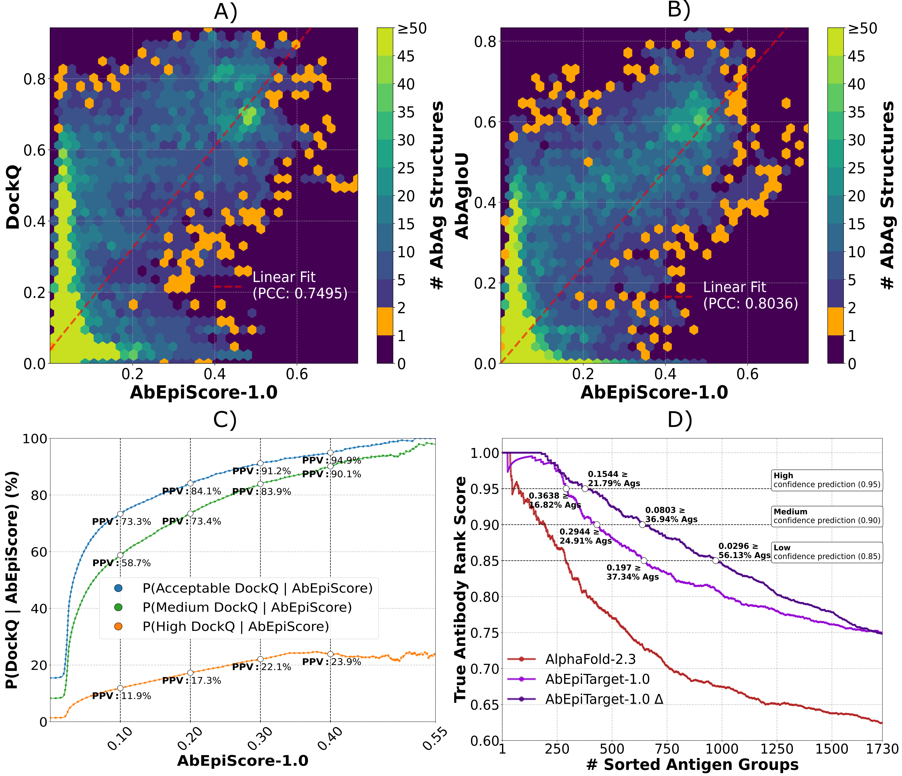

# AbEpiTope-1.0
AbEpiTope-1.0 is a computational tool that features two scores: AbEpiScore-1.0, predicting the accuracy of modelled AbAg interfaces, and AbEpiTarget-1.0, for selecting the antibody most likely targeting a given antigen. AbEpiScore-1.0 was trained and evaluated to predict AbAgIoU, measuring the match between predicted epitope and paratope residues and the corresponding ground truth crystal structures, on AlphaFold-2.3 structures made for 1730 antibody-antigen complexes. For each AbAg, 30 structures were made, totalling 51,900 AlphaFold-2.3 structures. AbAgIoU is stronlgy correlated with DockQ (PCC: 0.9392). AbEpiTarget-1.0 was trained and evaluated to identify the true AbAg (featuring the correct antibody and antigen) in 1,730 groups of AbAg complexes also contaning three swapped AbAgs (modelled with the same antigen, but incorrect antibody). 
* **Higher AbEpiScore score = Better antibody-antigen interface.**
* **Higher AbEpiTarget-1.0 score = Higher probability that the antibody will target the antigen.**

Both use the pretrained inverse folding model, ESM-IF1. As input, both models expect predicted or solved antibody-antigen complexes in PDB/CIF format. AbEpiTope-1.0 was trained to evaluate predicted AlphaFold structures, and it will not produce good scoring for structures produced by rigid-body docking.
## License
AbEpiTope-1.0 was developed by the Health Tech section at Technical University of Denmark (DTU). The code and data can be used freely by academic groups for non-commercial purposes. If you plan to use these tools for any for-profit application, you are required to obtain a separate license (contact Morten Nielsen, morni@dtu.dk).

## Webserver
AbEpiTope-1.0 is freely available as a web server at [https://services.healthtech.dtu.dk/services/AbEpiTope-1.0.](https://services.healthtech.dtu.dk/services/AbEpiTope-1.0). 

## Installation 
It is important that you follow the steps and do not install a latest pytorch and cudatoolkit version. 
The reason is that we need the installation to be compatible with a Pytorch Geometric.

### Create Conda Environment
```
$ conda create -n inverse python=3.9 ## important that it is python version 3.9
$ conda activate inverse
$ conda install pytorch=1.11 cudatoolkit=11.3 -c pytorch   ## very important to specify pytorch package!
$ conda install pyg -c pyg -c conda-forge ## very important to make sure pytorch and cuda versions not being changed
$ conda install pip
```
### Install Pip Packages 
```
First, download requirements.txt file. Then,
$ pip install -r requirements.txt #install package dependencies
$ pip install git+https://github.com/mnielLab/AbEpiTope-1.0.git #install source code directly with pip
```
## Usage 

### Inputs 
AbEpiTope-1.0 takes structures files of antibody-antigen complexes in **PDB or CIF format as input**. These structure files can be solved or predicted structures.
1. Structure files must include a light and heavy chain or a single-chain variable fragment (scFv), along with one or more antigen chains. Light and heavy chains are automatically detected. **Note:** Scores will not be produced for antibody-antigen structures where this is not detected. 
2. The antibody-antigen interface is made up of epitope and paratope residues. We define epitope residues as any antigen residues with at least one heavy atom (main-chain or side-chain) at a distance of 4 Å or less to any light or heavy chain. The corresponding interacting residues on the light or heavy chain are the paratope residues. **Note:** Scores will not be produced if epitope and paratope residues are not detected at the set Å distance.. By default, this distance is set at 4 Å, but can be set to custom Angstrom (Å). 

### Outputs 
AbEpiTope-1.0 outputs a the following three output files.  
1. The first, **output.csv**, is the most useful output file that lists each input structure file along with its AbEpiScore-1.0 and AbEpiTarget-1.0 scores.
   These scores are not sorted.
   * Higher AbEpiscore-1.0 Score = More accurate antibody-antigen interface.
   * Higher AbEpiTarget-1.0 Score = Higher probability that the antibody targets the antigen.   
2. The second, **interface.csv**, lists each input structure file along with epitope and paratope residues used to compute these scores
   * **Note:** If a row contains "None" in any column, it indicates that no antibody was identified, or no AbAg interface was detected within the specified Å distance.
   * **Note:** You may see duplicate rows for the same epitope-paratope residue pair. This is expected and reflects multiple distinct atomic interactions between those residues.
4. The third, **abag_sequence_data.fasta**, is a fasta formmatted file containing the sequences in each each antibody-antigen complex. The header >FILENAME_CHAINNAMES and the sequences of each abag are joined with ':'.

An additional fourth output file, **failed_files.csv**, may also be outputted. This an error file that only appears if an error occurs for one or more of input files. Each row contains filename and reason for the error.

### Example
We provide a python code snippet hereunder as well as a notebook (demo.ipynb) for running AbEpiTope-1.0 on 30 AlphaFold-2.3 predicted strucutures of antibody targeting the PD1-receptor (PDB: 7E9B).
These predicted structures can found under ./abag_exampledata/Cancer. 

```python
# imports and static stuff
import torch
from abepitope.main import StructureData, EvalAbAgs
from pathlib import Path
STRUCTUREINPUTS = Path.cwd() / "abag_exampledata" / "Cancer" # directory containing PDB or CIF files (can also be a single PDB/CIF file)
ENCDIR = Path.cwd() / "encodings" # directory for storing ESM-IF1 encodings
TMPDIR = Path.cwd() / "temporary" # directory for storing temporary files 

# create 4Å (default) distance antibody-antigen interface esmif1 encodings of structure files
data = StructureData()
data.encode_proteins(STRUCTUREINPUTS, ENCDIR, TMPDIR) # use atom_radius for setting custom antibody-antigen interface Å distance for example 4.5Å, interface data.encode_proteins(STRUCTUREINPUTS, ENCDIR, TMPDIR, atom_radius=4.5) 

# compute AbEpiScore-1.0 and AbEpiTarget-1.0 scores for antibody-antigen complex structures at set antibody-antigen Å distance 
# save results output files (see 'Outputs')
eval_abags = EvalAbAgs(data)
outdir = Path.cwd() / "output"
eval_abags.predict(outdir)
```
### Guidance on using AbEpiTope-1.0 scores for predicting modelled AbAg accuracy and antibody screening  



**Figure: We illustrate how AbEpiScore-1.0 can be applied to predict the modelled AbAg accuracy and how AbEpiTarget-1.0 can be used for antibody screening** **A)** AbEpiScore-1.0 scores for 51.900 predicted antibody-antigen structures plotted against corresponding DockQ values (y-axis) in hexagonal bins. Color scales capped at 50 structures, show the structure count per bin and orange indicates single structure bins. A red dashed line indicates a linear fit computed across all AbAg structures. **B)** Same as A), but plotting AbEpiScore-1.0 against AbAgIoU values. **C)** The PPV values for predicting whether 51.900 predicted antibody-antigen complexes have acceptable, medium or high DockQ (y-axis) as a function of X AbEpiScore-1.0 (x-axis) was computed in the range (0.0-0.55). PPV values for selected AbEpiScore are indicated with white dots. **D)** Evaluation of AbEpiTarget-1.0, AbEpiTarget-1.0 Δ, and AlphaFold 2.3 confidence scores for identifying correct AbAg pairs. For AbEpiTarget-1.0 and AlphaFold 2.3, the 1730 antigens groups were ranked by their maximum score (from either the true AbAg or one of the three swapped AbAgs). For AbEpiTarget-1.0 Δ, by the score gap between the top two pairs. The y-axis shows average True Rank Scores (0 = worst, 1 = perfect ranking of true AbAg) as more antigen groups are included (x-axis). White dots indicate score cutoffs corresponding to expected True Rank Scores of 0.85, 0.90, and 0.95.

* **Predicting modelled AbAg Accuracy with AbEpiScore-1.0, A) and B):** A modelled antibody-antigen structure with an AbEpiScore-1.0 of 0.3, has an expected interface accuracy 0.3 ≈ 0.400 DockQ or ≈0.373 AbAgIoU.
* **Predicting modelled AbAg Accuracy with AbEpiScore-1.0, C):** A modelled antibody-antigen structure with an AbEpiScore-1.0 of 0.3, has a 91.2%, 83.9%, and 22.1% probability of having acceptable (≥0.23), medium (≥0.49) and high (≥0.8) DockQ interface accuracy respectively.
* **High confidence antibody screening with AbEpiTarget-1.0, D):** For an antigen group (antibodies modelled to the same antigen), only predict the highest scoring antibody-antigen pair as the correct antibody, if its AbEpiTarget-1.0 score is 0.1544 more than the second best scoring antibody-antigen pair.
* **Medium confidence antibody screening with AbEpiTarget-1.0, D):** For an antigen group (antibodies modelled to the same antigen), only predict the highest scoring antibody-antigen pair as the correct antibody, if its AbEpiTarget-1.0 score is 0.0803 more than the second best scoring antibody-antigen pair.
* **Low confidence antibody screening with AbEpiTarget-1.0, D):** For an antigen group (antibodies modelled to the same antigen), only predict the highest scoring antibody-antigen pair as the correct antibody, if its AbEpiTarget-1.0 score is 0.0296 more than the second best scoring antibody-antigen pair.


